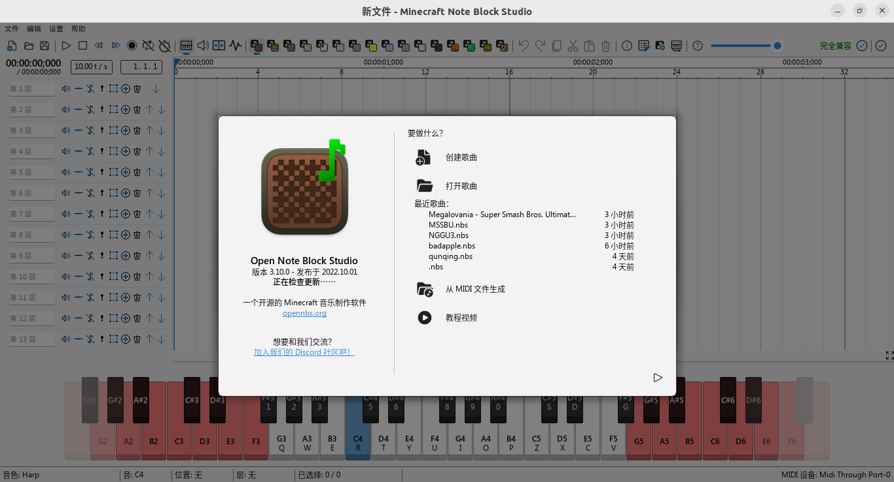
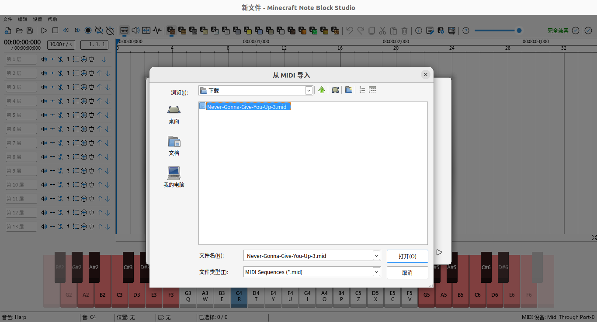
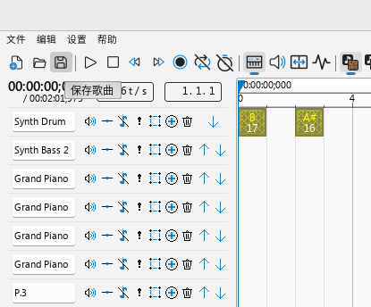

# 如何获得.nbs文件
[English user please check there](nbs_en.md)
## 安装Note Block Studio
从官网下载最新版本的[Note Block Studio](https://opennbs.org/),然后运行Minecraft.Note.Block.Studio.exe文件

如国你已经安装了Wine或者是Windows系统，可以跳过这一步骤

如果你是Linux系统，可能需要先安装[Wine](https://www.winehq.org/),使用以下命令进行安装

Ubutun/Debian:
```bash
sudo apt install wine
```
或从[官网下载二进制文件](https://www.winehq.org/)进行编译

安装Note Block Studio的过程和其它Windows软件基本一致，因此不再赘述

安装完成后如下图所示：

## 获取MIDI音乐

- 从例如[Bitmidi](https://bitmidi.com/)等网站直接下载MIDI文件
- 使用例如[Audio-convert](https://audio-convert.com/zh/mp3-converter/mp3-to-midi)等网站将MP3转换成MIDI文件
- 使用Note Block Studio直接制作nbs文件

## 转换成nbs文件
点击```从MIDI文件生成```按钮，选择你的MIDI文件,然后导入它：

点击保存歌曲按钮：


这样你的nbs文件制作就大功告成了

如果你有更多问题，请前往Note Block Studio,Wine官方寻求答案这里只是一个简单的介绍