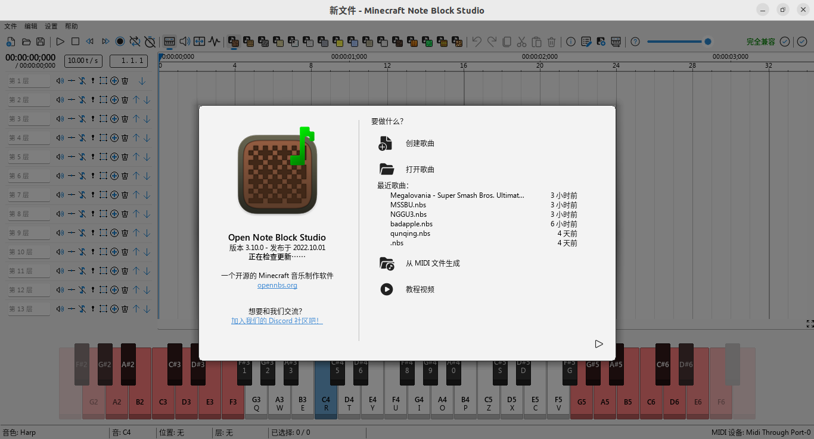
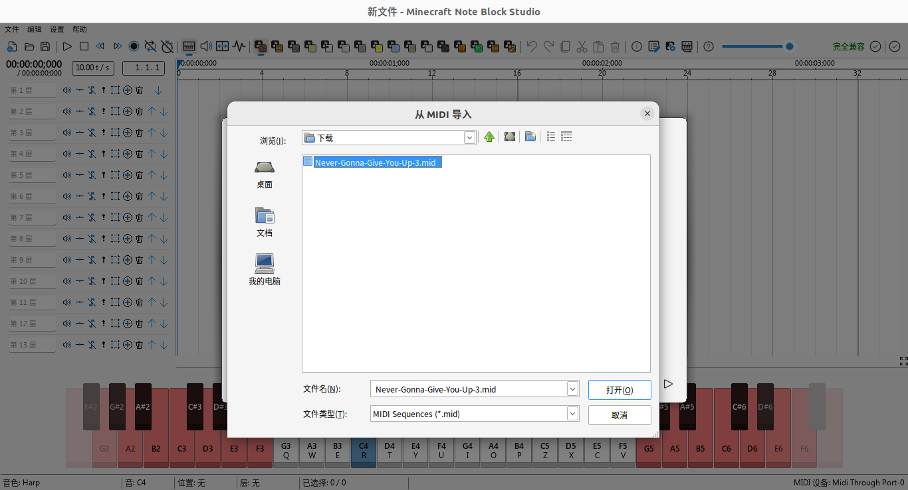

# How to get .nbs file
[中文用户请点击这里](nbs.md)
## Install Note Block Studio
Download the latest version of [Note Block Studio](https://opennbs.org/) from the official website, and then run the Minecraft.Note.Block.Studio.exe file

If you have already installed Wine or Windows system, you can skip this step.

If you are using a Linux system, you may need to install [Wine](https://www.winehq.org/) first. Use the following command to install it.

Ubutun/Debian:
```bash
sudo apt install wine
```
Or compile from [download binary files from the official website](https://www.winehq.org/)

The process of installing Note Block Studio is basically the same as other Windows software, so I won’t go into details here.

After the installation is completed, it will look like the picture below:

## Get MIDI music

- Download MIDI files directly from websites such as [Bitmidi](https://bitmidi.com/)
- Use websites such as [Audio-convert](https://audio-convert.com/en/mp3-converter/mp3-to-midi) to convert MP3 to MIDI files
- Use Note Block Studio to directly create nbs files

## Convert to nbs file
Click the Generate from MIDI file button, select your MIDI file, and import it:

Click the Save Song button:


In this way, your nbs file production is complete.

If you have more questions, please go to Note Block Studio, Wine official for answers. This is just a brief introduction.